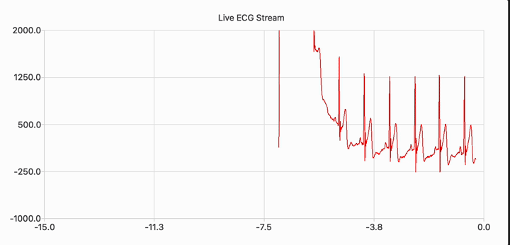
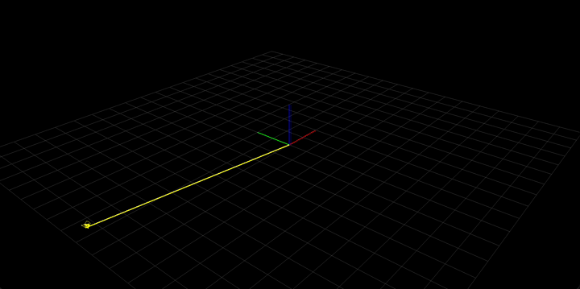
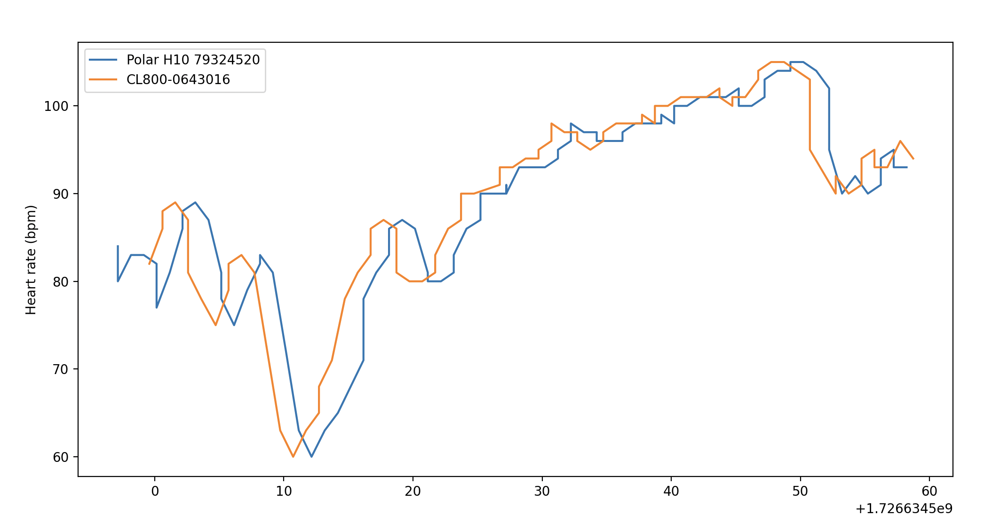

=============
blehrm
=============

Blehrm is a platform for streaming data from bluetooth low energy (BLE) heart rate monitors. Built on `Bleak <https://github.com/hbldh/bleak>`_
Blehrm provides a simple asynchronous platform to connect with commonly available heart rate monitors including the Polar H10.

- Free software: MIT License

Supported Devices:
------------------
- Polar H10
- Garmin HRM Pro
- CL800

Installation
------------

.. code-block:: bash

    pip install blehrm

Features
--------
- Stream interbeat interval (time between heart beats), and raw ECG and accelerometer for supported devices
- A simple interface to easily extend to other BLE HR monitors
- Discover supported BLE HR monitors nearby

Usage
=====

To discover (supported) HR monitors:

.. code-block:: python

    from blehrm.registry import blehrmRegistry 
    from blehrm import readers
    from bleak import BleakScanner
    import asyncio

    async def main():
        print('Scanning for devices...')
        ble_devices = await BleakScanner.discover()
        supported_sensors = blehrmRegistry.get_supported_devices(ble_devices)
        blehrmRegistry.print_supported_devices(supported_sensors)

    if __name__ == "__main__":
        asyncio.run(main())

Connect and stream interbeat interval 
Consume data stream with a callback

.. code-block:: python

    from blehrm import readers
    from blehrm import registry
    from bleak import BleakScanner
    import asyncio
    import sys
    from datetime import datetime

    ADDRESS = "34987821-60E5-03FB-70CC-BF552DC66039"

    def print_callback(data):

        sys.stdout.write(f"\r{epoch_s_to_datetime(data[0])}: {ibi_to_hr(data[1])} bpm")
        sys.stdout.flush()

    def ibi_to_hr(ibi):
        return round(60000/ibi, 1)

    def epoch_s_to_datetime(epoch_s):
        try:
            return datetime.fromtimestamp(epoch_s).strftime("%Y-%m-%d %H:%M:%S.%f")
        except Exception as e:
            return f"Error: {e}"
        
    async def main():
        
        ble_device = await BleakScanner.find_device_by_address(ADDRESS, timeout=20.0)
        if ble_device is None:
            print(f"Device with address {ADDRESS} not found")
            return

        blehrm_reader = registry.blehrmRegistry.create_reader(ble_device)    
        await blehrm_reader.connect()
        await blehrm_reader.start_ibi_stream(print_callback)

        while True:
            await asyncio.sleep(1)

    if __name__ == "__main__":
        try:
            asyncio.run(main())
        except KeyboardInterrupt:
            print("\nStream stopped by user.")

Examples
=======

Live ECG
--------
examples/live_ecg.py

Accelerometer visualisation
--------
examples/live_acc.py

Compare HR accuracy between sensors
------
examples/hr_comparison.py

Development
==========

Extend support for a custom HR monitor by subclassing the interface base class, and implementing two methods:

.. code-block:: python
    
    # blehrm/readers/custom_hrm.py

    from blehrm.interface import SensorReaderInterface
    from blehrm.registry import blehrmRegistry
    import time
    import numpy as np

    @blehrmRegistry.register("CustomHRMReader")
    class CustomHRMReader(SensorReaderInterface):
        
        def __init__(self, ble_device):
            super().__init__(ble_device)
        
        @staticmethod
        def is_supported(device_name):
            return device_name is not None and "Device_name" in device_name
        
        def _ibi_data_processor(self, bytes_data):
            ibi = bytes_data_to_ibi(bytes_data) # Code to process bytes message to ibi

            return np.array([time.time_ns/1.0e9, ibi])